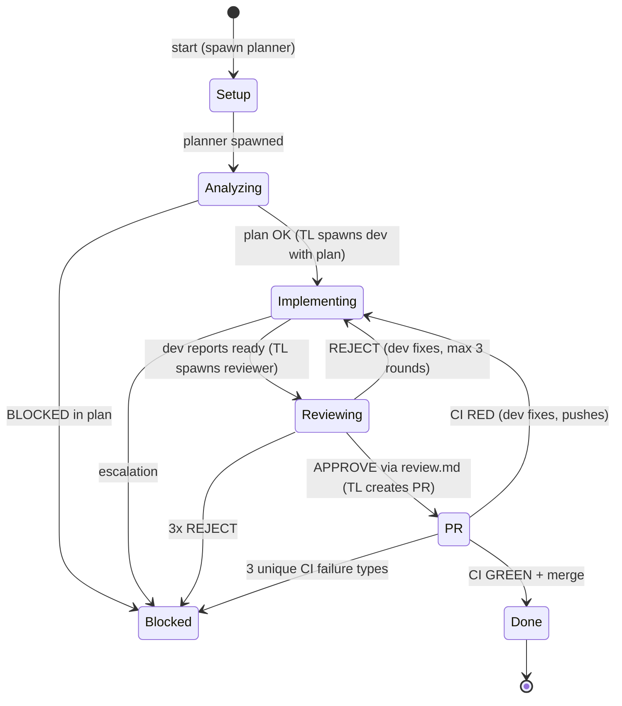

<!-- fleet-commander v0.0.17 -->
<!-- Fleet Commander workflow template. Installed by Fleet Commander into your project. -->
<!-- Placeholders fleet-commander, fleet-commander, main, {{ISSUE_NUMBER}} are replaced during installation. -->

# Diamond Workflow — fleet-commander

## About Fleet Commander

Fleet Commander (FC) is the orchestration layer that manages your team. Key facts:

- **Hooks** — FC monitors agent activity via hooks installed in the repo. Every tool use, session start/end, notification, and error is reported automatically. You do not need to report progress manually.
- **CI/PR updates via stdin** — FC watches GitHub for CI results and PR status. When something changes, FC sends a message directly to the Team Lead (TL) via stdin. No PR Watcher agent is needed.
- **Dashboard** — The PM watches all teams from the FC dashboard. They can see your state (Analyzing, Implementing, Reviewing, PR, Done, Blocked), recent events, and output in real time.
- **Messages from FC** — FC may send structured messages to the TL (see "FC Messages" section below). These arrive as stdin messages and should be acted on promptly.
- **Idle/Stuck thresholds** — FC marks agents idle after 5 minutes of inactivity and stuck after 10 minutes. Agents waiting for peer messages are expected to be idle — this is normal. TL should only intervene when stuck.

## Worktree Awareness

You are running inside a **git worktree**, not the main repository checkout. This has critical implications:

- **NEVER run `git checkout main`** — the base branch is already checked out in the main worktree. Attempting to check it out here will fail with "already used by worktree."
- **Use `git fetch origin main` and reference `origin/main`** whenever you need the latest base branch state. Do not try to switch to it.
- **Your branch is your branch.** Create it, work on it, push it. Never switch away from it to main.
- This applies to ALL agents (planner, dev, reviewer) — none of them should ever attempt to checkout main.

## Entry Point

```
User: claude --worktree fleet-commander-{N}
(prompt is sent via stdin from Fleet Commander's prompt file)
```

**Role of TL (main agent = You):**
1. Read this workflow and understand the team structure
2. **Phase 0: Spawn `fleet-planner` only** — planner analyzes the issue and produces a plan
3. **Read the planner's plan** — after planner completes, read `plan.md` from the worktree root
4. **Phase 2: Spawn `fleet-dev` with the plan context** — dev starts implementing immediately
5. **Wait for dev to report "ready for review"** — dev sends a message when implementation is complete
6. **Phase 3: Spawn `fleet-reviewer`** — reviewer starts reviewing immediately
7. Let dev and reviewer communicate peer-to-peer — DO NOT relay messages between them
8. Only intervene if: escalation after 3 review rounds, agent stuck (10min idle), or final PR creation
9. When review passes: rebase, create PR, set auto-merge
10. Respond to FC messages (ci_green, ci_red, pr_merged, nudge_idle, nudge_stuck)
11. On pr_merged: close issue, shut down agents, finish

## Team Composition — Diamond (3 Agents)

| Agent | subagent_type | name | Role | Spawn |
|-------|---------------|------|------|-------|
| **Planner** | `fleet-planner` | `planner` | Analyzes issue + codebase, produces structured plan with guidebook paths. Writes plan to `plan.md`. Stays alive for p2p questions from dev and reviewer. | Phase 0 (immediate) |
| **Dev** | `fleet-dev` | `dev` | Receives planner's plan at spawn, implements code, writes tests, pushes commits. Communicates with reviewer directly during review. Can ask planner questions via p2p. | Phase 1 (after plan) |
| **Reviewer** | `fleet-reviewer` | `reviewer` | Spawned after dev reports ready. Two-pass code review. Sends feedback directly to dev. Writes final verdict to `review.md`. Can ask planner questions via p2p. | Phase 2 (after dev ready) |

There is NO coordinator agent. The TL orchestrates all three agents directly.

All agents use `model: inherit` — they run on the same model as the TL.

### Agent Lifecycle

- **Agents are spawned sequentially** as each phase completes. This gives each agent the context it needs to start working immediately.
- **Planner** is spawned first (Phase 0). It analyzes the issue, produces the plan, writes it to `plan.md`, and **stays alive** — available for p2p questions from dev and reviewer throughout the workflow. After writing `plan.md`, the planner should stop producing output and wait; the Claude Code runtime keeps the session alive automatically, and incoming p2p messages arrive via stdin.
- **Dev** is spawned after the plan arrives (Phase 1). The TL includes the planner's plan in the dev's task prompt, so dev can start implementing immediately — no waiting.
- **Reviewer** is spawned after dev reports ready (Phase 2). The TL includes the branch name and context in the reviewer's task prompt, so reviewer can start reviewing immediately — no waiting.
- Once spawned, **agents stay alive** until the team is done. Planner persists as a knowledge resource. Dev persists through review rounds and CI fixes. Reviewer persists through all review rounds. After completing your deliverable, simply stop producing output. The Claude Code runtime keeps your session alive automatically. You will receive incoming messages via stdin when another agent contacts you. Do not call any tools or produce any output until a message arrives.
- Dev and Reviewer communicate **peer-to-peer** — TL does not relay messages between them.

### Markdown Handoff Pipeline

The Diamond Team uses a file-based handoff pattern. Each agent produces a markdown file, and the TL reads it and passes the content to the next agent in their spawn prompt:

| Phase | Producer | File | Consumer (via TL) |
|-------|----------|------|--------------------|
| 0→1 | FC | `.fleet-issue-context.md` | Planner |
| 1→2 | Planner | `plan.md` | Dev |
| 2→3 | Dev | `changes.md` | Reviewer |
| 3→TL | Reviewer | `review.md` | TL |

**TL is the relay** — subagents never read each other's files directly. TL reads each file and includes the content in the next agent's spawn prompt. Files stay in the worktree (listed in `.gitignore`, never committed, cleaned up with the worktree).

**SendMessage = notification only** — agents write their file, then send a short ping to TL:
- Planner: `"Done. Plan written to plan.md."`
- Dev: `"Ready for review. Branch: {branch}. Changes in changes.md."`
- Reviewer: `"Review complete. Verdict in review.md."`

Agents NEVER put deliverable content in SendMessage. The file is the delivery mechanism, the message is just a ping.

**Do NOT delete handoff files** — they are in `.gitignore` and will be cleaned up when the worktree is removed. Keeping them allows TL to re-read if needed.

### TYPE to Guidebook Mapping

All implementation work is assigned to the single `fleet-dev` agent. The Planner's TYPE and Guidebooks fields tell the dev which guidebooks to read for domain-specific conventions.

| TYPE in plan | Guidebooks to read |
|---------------|-------------------|
| C# / .NET | `csharp-conventions.md` |
| F# | `fsharp-conventions.md` |
| TypeScript / JS | `typescript-conventions.md` |
| Python | `python-conventions.md` |
| Infrastructure / CI | `devops-conventions.md` |
| Generic / unknown | CLAUDE.md only (no language-specific guidebook) |
| Mixed (A + B) | Multiple guidebooks — dev reads all relevant ones |

## Workflow State Machine



**Agents are spawned sequentially as phases complete.** Phase transitions represent when agents are spawned and which agent is actively doing primary work.

**Blocked can be entered from any active state** when the team cannot proceed (missing info, unresolvable conflicts, repeated failures).

Note: These phases represent the workflow's internal progression, not FC's team status tracking (queued/launching/running/idle/stuck/done/failed). FC tracks team status independently via hooks.

---

## Phase 0 — Setup (Spawn Planner)

1. **TL reads `.fleet-issue-context.md`** from the worktree root (if it exists). This file contains the full issue body, comments, labels, acceptance criteria, and dependencies — pre-fetched by Fleet Commander at launch time.
2. **TL spawns `fleet-planner`** with the full issue context included in the spawn prompt (see Planner Task Format below). The planner receives everything it needs — it should NOT need to call `gh issue view`. If `.fleet-issue-context.md` did not exist, tell the planner to fetch the issue itself via `gh issue view`.
3. **Wait for the planner's ping.** The planner will send a SendMessage when done: `"Done. Plan written to plan.md."` Do NOT proceed until you receive this ping. Do NOT poll for plan.md. Do NOT assume the planner is done because it went quiet. Just wait — the ping will arrive.
4. When the ping arrives, read `plan.md` and proceed to Phase 1. Do NOT wait for the planner to exit — it stays alive for p2p questions.
5. Planner analyzes the issue context (provided in its spawn prompt), explores the codebase, discovers guidebooks, and produces a structured plan.
6. Planner writes the plan to `plan.md` in the worktree root. Planner stays alive for p2p questions from dev and reviewer.

---

## Waiting for Agent Deliverables

**TL waits for pings, not polls.** Each agent sends a SendMessage ping when their deliverable is ready:
- Planner: `"Done. Plan written to plan.md."`
- Dev: `"Ready for review. Branch: {branch}. Changes in changes.md."`
- Reviewer: `"Review complete. Verdict in review.md."`

**Do NOT proceed to the next phase until you receive the ping AND the file exists.** If you receive a ping but the file is missing, ask the agent to write it. If the agent exited without pinging, check if the file exists — if not, respawn (within budget).

**Do NOT poll with TaskList in a loop.** Polling wastes tool calls and makes you impatient. The pings will arrive. Being idle while waiting is normal — FC knows you are waiting and will not penalize you.

### When An Agent Exits Without Delivering

If an agent exits (SubagentStop) before sending its ping:
1. Check if the deliverable file exists anyway (Read tool)
2. If the file exists → proceed to next phase
3. If the file does NOT exist → respawn the agent (within respawn budget)
4. Do NOT skip the deliverable — every phase REQUIRES its file

### Respawn Budget

**Maximum 5 total subagent spawns per team run.** This includes all initial spawns and all respawns across all agent types (planner, dev, reviewer).

- Track your spawn count. Each `TaskCreate` call increments the count.
- If you reach 5 spawns and an agent exits without delivering, **do NOT respawn**. Instead:
  1. Take over the agent's role yourself (TL fallback).
  2. If the role is too complex to take over (e.g., full implementation), report BLOCKED to FC.
- This budget prevents respawn storms that waste time and resources without making progress.

---

## Phase 1 — Analysis

1. Planner (spawned in Phase 0) reads the issue, explores the codebase, discovers guidebooks, and produces a structured plan
2. **Planner writes the plan to `plan.md` in the worktree root** using the Write tool, then pings TL via SendMessage
3. TL reads `plan.md` from the worktree root using the Read tool. Do NOT delete it — it stays in `.gitignore`. If `plan.md` does not exist after the planner's ping (or after 60 seconds), treat this as a planner failure and restart the planner (counts toward 5-spawn budget).
4. TL validates the plan has all required fields (see format below)
5. TL evaluates the plan:
   - `BLOCKED=yes` → state Blocked, comment on issue, STOP
   - `BLOCKED=no` → proceed to Phase 2 (spawn dev with the plan)
   - Missing required fields → ask Planner to redo with specific gaps identified

### Plan Format

The Planner produces a plan in this format:

```
## Plan for Issue #{N}

### Language/Framework
{primary language} / {framework(s)}

### Guidebooks
- {path/to/guidebook1.md}
- {path/to/guidebook2.md}
- (none found)

### Type
{single | mixed} — {developer mapping}

### Implementation Steps
1. {step} — {details}
2. {step} — {details}

### Architectural Decisions
- {decision and rationale}

### Edge Cases
- {edge case and how to handle it}

### Acceptance Criteria
- [ ] {criterion}

### Blocked
no | yes — {reason}
```

### Edge Case: Planner Fails

If the Planner is unresponsive for >5 minutes or produces an unusable plan:
1. TL performs a quick analysis directly: read `CLAUDE.md`, scan the issue, identify key files
2. Produce a minimal plan (Implementation Steps + Acceptance Criteria + Type is enough)
3. Proceed to Phase 2 — spawn dev with the TL-produced plan
4. Do NOT spend more than a few minutes on this — a good-enough plan is better than a perfect one

---

## Phase 2 — Implementation

1. **TL spawns `fleet-dev`** with the planner's plan included in the task prompt (see Dev Task Format below)
2. Dev starts implementing immediately — it has the plan, guidebook paths, and all context it needs
3. Dev implements, tests locally, commits atomically
4. **Dev writes `changes.md`** to the worktree root using the Write tool (see Changes Report Format below) — summarizing what changed, decisions made, test results, and `git diff --stat` output
5. **Dev pings TL** via SendMessage: `"Ready for review. Branch: {branch}. Changes in changes.md."` — the message is just a ping, report content is in the file
6. TL reads `changes.md` (do NOT delete it) and transitions to Phase 3 — spawns reviewer with the changes report included in the spawn prompt

### Planner Task Format (sent via TaskCreate at spawn)

```
ISSUE: #{N} {title}
PROJECT: {project_name}

ISSUE CONTEXT (from .fleet-issue-context.md):
{paste the full issue body/description here}

COMMENTS ({count}):
{paste all comments with author and date}

LABELS: {comma-separated labels}
DEPENDENCIES: {blocked-by list if any}

You already have the full issue context above — you do NOT need to run
`gh issue view`. Start directly with codebase exploration.
```

If `.fleet-issue-context.md` was NOT available, use this format instead:

```
ISSUE: #{N} {title}
PROJECT: {project_name}

The issue context file was not available. Please fetch the full issue:
  gh issue view {N} --repo "{github_repo}" --json title,body,comments,labels

Read the issue thoroughly before starting your analysis.
```

### Dev Task Format (sent via TaskCreate at spawn)

```
ISSUE: #{N} {title}
BRANCH: {feat|fix|test}/{N}-{short-desc}
BASE: main

ISSUE SUMMARY:
{1-3 sentence summary of what the issue requests}

ACCEPTANCE CRITERIA:
{bulleted list of acceptance criteria from the issue or plan}

PLAN:
{paste the full planner's plan here}

GUIDEBOOKS (read these before implementing):
{list of guidebook paths extracted from the plan}

INSTRUCTIONS:
1. Read CLAUDE.md in the project root
2. Read each guidebook file listed above
3. Parse the planner's plan for implementation details
4. Implement the changes described in the plan
5. Follow conventions from CLAUDE.md and guidebooks
6. Run build + tests locally before reporting ready
7. Commit atomically: "Issue #{N}: {description}"
8. Push the branch and report "Ready for review. Branch: {branch}" to TL
```

### Changes Report Format (written by dev to `changes.md`)

```markdown
# Changes Report

## Summary
{1-2 sentence summary of what was done}

## Changed Files
- `src/server/services/foo.ts` — Added bar() method for X
- `tests/server/foo.test.ts` — 3 new tests for bar()

## Decisions & Deviations
- {any deviations from plan with justification}

## Test Results
- `npm test`: 45 passed, 0 failed
- `npx tsc --noEmit`: clean

## Known Limitations
- {any TODOs or known issues}

## Diff Stats
{paste output of `git diff --stat` here}
```

### Edge Case: Dev Gets Stuck

- FC's stuck detector will nudge TL if the team is idle too long
- TL checks if the dev agent is still active (TaskList)
- If dev is stuck: send a message with more context, hints, or simplified scope
- If dev is unresponsive after nudge: stop the dev agent, spawn a fresh one with additional context from the failed attempt

---

## Phase 3 — Review (Peer-to-Peer)

1. **TL reads `changes.md`** from the worktree root (written by dev). This contains the dev's change summary, decisions, test results, and diff stats. Do NOT delete it — it stays in `.gitignore`.
2. **TL spawns `fleet-reviewer`** with the branch name, issue context, guidebook paths, and the dev's changes report (see Reviewer Task Format below)
3. Reviewer starts reviewing immediately — it has all the context it needs, including the dev's own account of what changed and why
4. **Dev and reviewer already know each other's names** (set at spawn time). No TL introduction needed.
5. **TL steps back and WAITS for the reviewer's ping.** The dev-reviewer loop runs peer-to-peer:
   - Reviewer performs two-pass review (code quality + acceptance)
   - **REJECT** → reviewer sends actionable feedback directly to dev → dev fixes and re-requests review from reviewer directly
   - **APPROVE** → reviewer writes `review.md` using Write tool, pings TL: `"Review complete. Verdict in review.md."`
6. **TL does NOT proceed to PR creation until it receives the reviewer's ping AND `review.md` exists.** This is a hard requirement — no exceptions. Do NOT assume the review is done because the reviewer went quiet or exited.
7. TL does NOT intervene unless:
   - **3 review rounds exhausted** → TL arbitrates (see Error Handling)
   - **Escalation request** from either agent → TL steps in
   - **FC sends a nudge** → TL checks on the reviewer (see FC Messages below)

### Reviewer Task Format (sent via TaskCreate at spawn)

```
ISSUE: #{N} {title}
BRANCH: {branch_name}
BASE: main

ACCEPTANCE CRITERIA:
{bulleted list of acceptance criteria from the issue or plan}

CHANGES (from dev's changes.md):
{paste the full changes report here — summary, changed files, decisions, test results, diff stats}

GUIDEBOOKS (read these to verify compliance):
{list of guidebook paths from the plan}

INSTRUCTIONS:
1. Read CLAUDE.md in the project root
2. Read each guidebook file listed above
3. Read the dev's changes report above to understand what changed and why
4. Verify against the actual `git diff` — the changes report is the dev's account, not a substitute for reviewing the code
5. Two-pass review: code quality + acceptance criteria from the issue
6. Send rejection feedback DIRECTLY to dev via SendMessage
7. Write final verdict to review.md in the worktree root using the Write tool, then ping TL: "Review complete. Verdict in review.md."

PEERS:
- Dev agent name: dev
- Planner agent name: planner
- Send rejection feedback DIRECTLY to dev via SendMessage
- Write final verdict (APPROVE or CHANGES_NEEDED) to review.md using Write tool — then ping TL (SendMessage is only the ping, NOT the verdict)

If you reject, include a numbered list of specific, actionable fixes with file:line references.
Dev will fix and message you directly when ready for re-review.
Max 3 review rounds total (initial + 2 re-reviews).
After 3rd round, write review.md with CHANGES_NEEDED and wait for shutdown_request.
```

### TL Reads review.md

After receiving the reviewer's ping (`"Review complete. Verdict in review.md."`), the TL reads `review.md` from the worktree root. Do NOT delete it. The reviewer stays alive briefly for shutdown_request.

If the ping arrived but `review.md` does not exist, ask the reviewer via SendMessage to write it. If the reviewer has exited without writing it, respawn (within budget).

**NEVER proceed to PR creation without reading review.md.** No review.md = no PR.

1. **Read** `review.md` using the Read tool (do NOT delete it)
2. **Act on the verdict**:
   - `Status: APPROVE` → proceed to Phase 4 (PR creation)
   - `Status: CHANGES_NEEDED` → relay the issues to the dev via SendMessage, dev fixes, and TL re-spawns the reviewer (or arbitrates if rounds are exhausted)

### TL Non-Intervention Rules

During the dev↔reviewer loop, TL MUST NOT:
- Relay messages between dev and reviewer (they talk directly)
- Ask "how's it going?" before an agent is stuck (10min)
- Override reviewer's verdict (until round 3 escalation)
- Tell dev to skip fixing a review comment
- Inject new requirements not in the original issue

TL MAY:
- Respond to FC messages (ci_red, nudge_stuck, etc.)
- Intervene on escalation from either agent
- Arbitrate after 3 failed review rounds
- Nudge an agent that has been idle for 5+ minutes

---

## Phase 4 — PR

After TL reads `review.md` with `Status: APPROVE`:

1. **Branch freshness check** (MANDATORY):
   ```bash
   git stash --include-untracked && git fetch origin main && git rebase origin/main && git stash pop && git push --force-with-lease
   ```
   The `git stash --include-untracked` is required because the CC runtime may leave unstaged changes (e.g., `.claude/settings.json`) that block rebase.
   If rebase fails (conflicts) → state Blocked.

2. **TL creates PR**:
   ```bash
   gh pr create --base main --title "Issue #{N}: {description}" --body "Closes #{N}"
   ```

3. **Set auto-merge immediately** (mandatory, no exceptions):
   ```bash
   gh pr merge {PR} --auto --squash --delete-branch
   ```

4. Wait for FC to send CI status via stdin:
   - `ci_green` → auto-merge handles merge → wait for `pr_merged`
   - `ci_red` → TL forwards failure details to dev → dev fixes and pushes
   - After 3 unique CI failure types → state Blocked (FC sends `ci_blocked`)
   - `pr_merged` → state Done

---

## Phase 5 — Done

1. Close issue: `gh issue close {N} --comment "Closed. PR #{PR} merged."`
2. **Explicit shutdown sequence** (MANDATORY):
   a. Run `TaskList` to identify all active subagents.
   b. For each active subagent, send `shutdown_request` via `TaskUpdate`.
   c. Run `TaskList` again to verify all subagents have exited.
   d. If any subagent is still running after shutdown_request, send a second shutdown_request, then proceed regardless.
3. TL finishes

---

## BLOCKED State

Entered from any phase when the team cannot proceed:
1. Comment on the issue explaining what blocks progress
2. Report blocker details to FC (visible in dashboard)
3. STOP all work — wait for PM instructions from FC dashboard

---

## FC Messages

Fleet Commander sends these messages directly to the TL via stdin. They arrive automatically — no polling needed.

| Message ID | When | Content |
|------------|------|---------|
| `ci_green` | CI passes on PR | "CI passed on PR #{PR}. All checks green. Auto-merge is {status}." |
| `ci_red` | CI fails on PR | "CI failed on PR #{PR}. Failing checks: {details}. Fix count: {N}/{max}." |
| `ci_blocked` | Too many CI failures | "STOP. {N} unique CI failure types on PR #{PR}. Wait for instructions." |
| `pr_merged` | PR is merged | "PR #{PR} merged. Close the issue, clean up, and finish." |
| `nudge_idle` | Team idle 5+ min | "FC status check: You've been idle for {N} minutes. If waiting for subagents, run TaskList to verify they are still active. If a phase just completed, proceed to the next step." |
| `nudge_stuck` | Team stuck 10+ min | "You appear stuck. Report status or ask for help." |
| `issue_comment_new` | New non-bot comment on issue | "New comment on issue #{KEY} by @{author}: {body}" |
| `issue_labels_changed` | Priority/blocking labels change | "Labels changed on issue #{KEY}: {added} added, {removed} removed." |
| `issue_closed_externally` | Issue closed outside team | "Issue #{KEY} was closed externally. Wrap up and shut down." |
| `issue_body_updated` | Issue description edited | "The description of issue #{KEY} has been updated. Review latest requirements." |

### TL Response to FC Messages

**On `ci_green`**: Auto-merge will handle the merge. Acknowledge and wait for `pr_merged`.

**On `ci_red`**: Forward failure details to dev. Dev fixes and pushes. This counts toward the failure limit.

**On `ci_blocked`**: STOP all work. Wait for PM instructions from the dashboard.

**On `pr_merged`**: Close the issue, shut down agents (`shutdown_request` to all), finish.

**On `nudge_idle`**: You are being nudged because FC detected no activity for 5 minutes. This is often normal — you may be waiting for an agent's ping. **Your first action MUST be to check on the active agent via SendMessage** (e.g., ask the reviewer: "How is the review going? Do you need help?"). Do NOT skip waiting for a deliverable just because you were nudged. Do NOT "proceed to the next step" without the required file (plan.md / changes.md / review.md). Only respawn if the agent has exited without delivering.

**On `nudge_stuck`**: Same as nudge_idle but more urgent. **First action: SendMessage to the active agent** asking for status. If the agent responds — wait for it to finish. If no response after 2 minutes — check if it exited (TaskList). If exited without deliverable — respawn (within budget). Do NOT skip phases.

**On `issue_comment_new`**: Review the new comment for any instructions or questions from the issue reporter. If the comment contains new requirements or clarifications, forward relevant details to the dev agent. If it's just acknowledgment, no action needed.

**On `issue_labels_changed`**: Check the label change for priority shifts. If a `blocking` or `urgent` label was added, prioritize accordingly. If `blocked` was added, check what's blocking and report to FC.

**On `issue_closed_externally`**: The issue was closed by someone outside the team. Stop all active work immediately. Commit any pending changes, push to the branch, and shut down all agents gracefully.

**On `issue_body_updated`**: Re-read the issue description for updated requirements. If the changes affect current implementation, forward the updated requirements to dev. If dev has already completed the affected work, assess whether rework is needed.

---

## Error Handling

### Agent Spawn Failure

If spawning any agent fails:
1. **Retry once** — wait 5 seconds, attempt spawn again
2. **If retry fails** — TL takes over that agent's role:
   - Planner fails → TL does the analysis themselves
   - Dev fails → TL implements the code themselves
   - Reviewer fails → TL reviews the code themselves (still two-pass)
3. Log the failure for FC visibility (FC sees it via hooks)

### Test Failure During Implementation

1. Dev runs tests locally before reporting "ready for review"
2. If tests fail → dev fixes and re-runs until green
3. Dev does NOT report "ready for review" with failing tests
4. If dev cannot fix tests after reasonable effort → dev reports blocker to TL → TL may assist or escalate

### Review Loop Stuck (3 Rounds Exhausted)

After 3 review rounds (initial + 2 fix rounds) with REJECT:
1. Reviewer sends `BLOCKED — 3 review rounds exhausted` to TL
2. TL reads the latest rejection feedback and the current code
3. TL arbitrates:
   - If remaining issues are minor nits → TL overrides and proceeds to PR
   - If remaining issues are substantive → TL sends specific guidance to dev for one final attempt
   - If fundamentally broken → state Blocked, comment on issue

### Dev and Reviewer Disagree

If the same issue bounces back and forth between dev and reviewer:
- After round 2, if the same point is still contested, reviewer escalates to TL
- TL reads the diff and the reviewer's feedback
- TL arbitrates: either side with the reviewer (dev must fix) or override the reviewer (approve with noted exception)

### CI Failure Handling

1. `ci_red` received → TL forwards failure details to dev
2. Dev fixes the failing tests/checks and pushes
3. Progress on the same failure type does NOT count as a new unique failure
4. After 3 unique failure types → state Blocked (FC sends `ci_blocked`)

### Rebase Conflict

1. If `git stash --include-untracked && git rebase origin/main` fails with conflicts → state Blocked
2. Comment on issue explaining the conflict
3. STOP — do not attempt manual conflict resolution across worktrees

---

## Branch Naming

The TL determines the branch name based on the issue type and provides it to the dev in the task prompt:

| Prefix | Use |
|--------|-----|
| `feat/{N}-{desc}` | New feature |
| `fix/{N}-{desc}` | Bug fix |
| `test/{N}-{desc}` | Test-only changes |

### Commit Format

```
Issue #{N}: {description}
```

Atomic commits — each commit should be a logical unit.

### Build Before Review

**MANDATORY before reporting "ready for review"**: dev must run the project build and any new tests locally. This prevents unnecessary review iteration.

---

## Rules

- **One issue at a time** — atomic changes only
- **CI must be green** — PR CANNOT be merged with red CI
- **Branch from main** — NEVER commit directly to main
- **TL creates the PR** — dev pushes code, TL creates the PR and sets auto-merge
- **P2P for review** — dev and reviewer talk directly, TL does not relay
- **Idle = normal** — agents waiting for messages are expected to be idle
- **TL intervenes only on escalation, stuck, or PR** — do not micromanage the dev↔reviewer loop
- **Respond to FC messages promptly** — FC messages arrive via stdin and require action
- **TL does not implement** — spawn subagents for all work (except planner fallback)
- **Planner failure is not fatal** — TL can produce a minimal plan if planner fails

## Anti-Patterns

| Wrong | Right |
|-------|-------|
| TL relays messages between dev and reviewer | Dev and reviewer talk directly (p2p) |
| TL asks "how's it going?" every minute | Wait for agent's ping — idle is normal |
| TL implements code while dev is active | Let dev do the implementation |
| TL overrides reviewer without reading feedback | Read feedback, arbitrate only after 3 rounds |
| Dev pushes without local tests | Build + tests locally BEFORE reporting ready |
| Dev pushes without rebase | ALWAYS stash + rebase on main before push |
| Respawning agents endlessly | Max 5 total spawns — then TL takes over or reports BLOCKED |
| Checking out main in a worktree | NEVER checkout main — use `origin/main` as reference |
| Dev creates the PR | TL creates the PR after APPROVE |
| Spawning a coordinator / 4th agent | Diamond team is exactly 3 agents: planner, dev, reviewer |
| Spawning all 3 agents at once before analysis is done | Spawn sequentially: planner first, then dev with plan, then reviewer after dev ready |
| Ignoring FC messages | Always respond to ci_green, ci_red, pr_merged, nudges |
| Respawning agent after 2 min idle | Idle is normal — only act at 10min stuck threshold |
| TL monitors CI manually | FC handles CI monitoring and sends updates via stdin |
| TL polls TaskList in a loop while waiting | Wait for agent ping — polling wastes tool calls and makes TL impatient |
| TL proceeds to PR without review.md | NEVER — no review.md = no PR, hard requirement |
| TL skips waiting after FC nudge | On nudge: first ask the agent how it's going via SendMessage, then wait |
| Planner puts plan content in SendMessage | Planner writes plan.md, pings TL: "Done. Plan in plan.md." — TL reads file directly |
| Dev puts changes report in SendMessage | Dev writes changes.md, pings TL: "Ready. Changes in changes.md." — TL reads file directly |
| Reviewer puts verdict in SendMessage | Reviewer writes review.md, pings TL: "Review complete. Verdict in review.md." — TL reads file directly |
| Dev skips writing changes.md | Dev writes changes.md before pinging TL — TL passes content to reviewer |
| TL deletes handoff files (plan.md, changes.md, review.md) | Leave them — they're in .gitignore and cleaned up with the worktree |
| Subagents read each other's handoff files | TL is the relay — reads each file and pastes content into next spawn prompt |

## Decision Summary

```
Phase 0: TL → spawn planner only
Phase 1: Planner analyzes → writes plan.md → pings TL → TL reads plan.md → planner stays alive for p2p questions
         TL validates plan → spawns dev WITH the plan context
Phase 2: Dev implements immediately (has plan) → writes changes.md → pings TL ("Ready for review")
         TL reads changes.md → spawns reviewer WITH branch context + changes report
Phase 3: Reviewer reviews immediately (has branch + changes report) → dev + reviewer iterate p2p → reviewer writes review.md → pings TL → TL reads review.md
Phase 4: TL → rebase → create PR → set auto-merge → FC monitors CI
Phase 5: TL → close issue → shutdown agents → finish
```

Edge cases:
- Planner fails → TL does quick analysis, produces plan, spawns dev with it
- Planner declares BLOCKED → TL reports blocked, STOP
- Dev stuck → TL nudges, then restarts with more context
- 3 rejections → TL arbitrates: simplify, override nits, restart dev, or abort
- Dev/Reviewer disagree → TL arbitrates after round 2
- CI blocked → STOP, wait for PM
