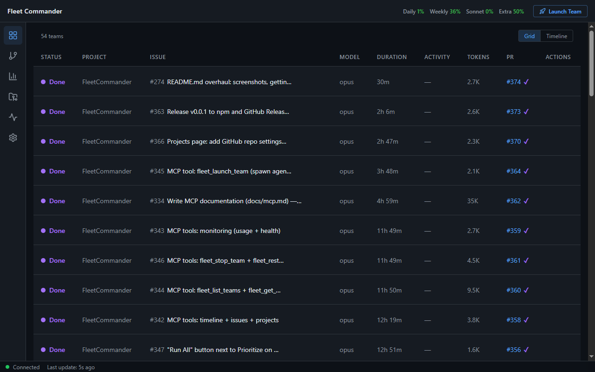
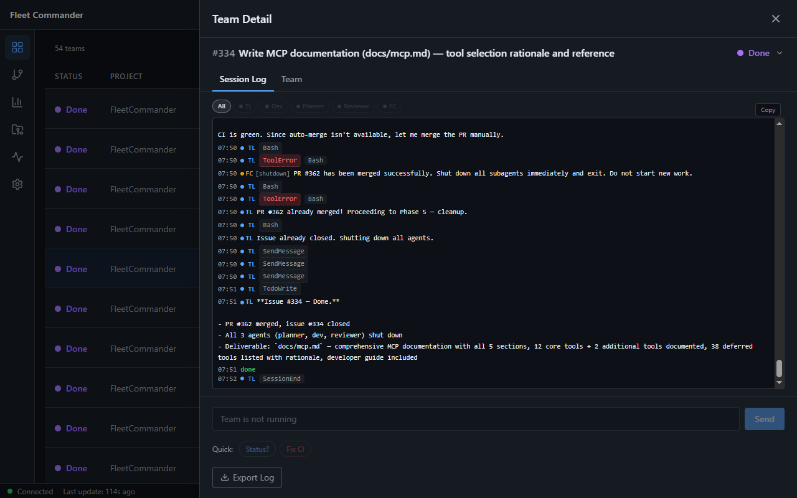
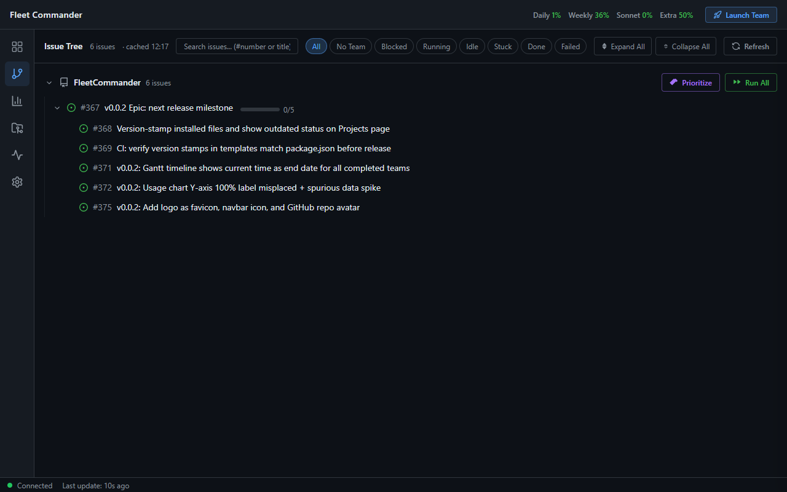
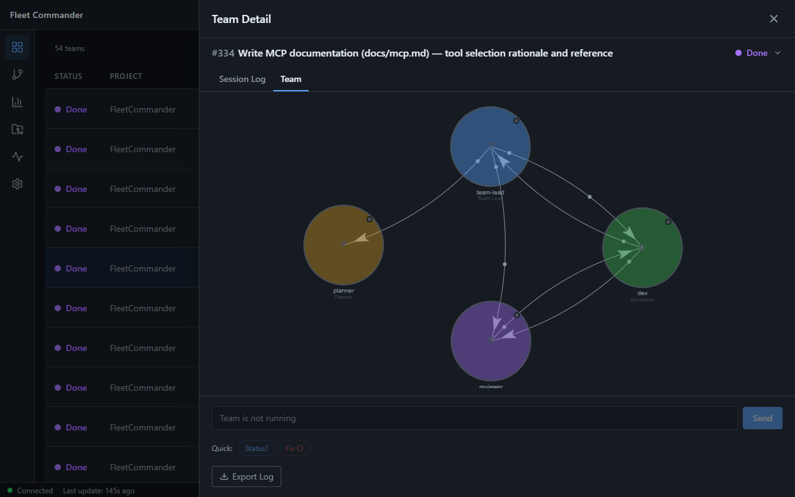
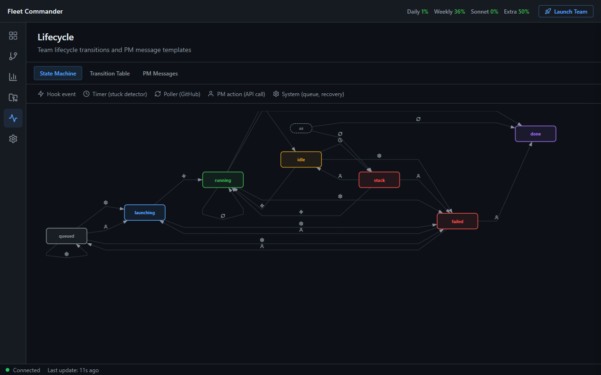
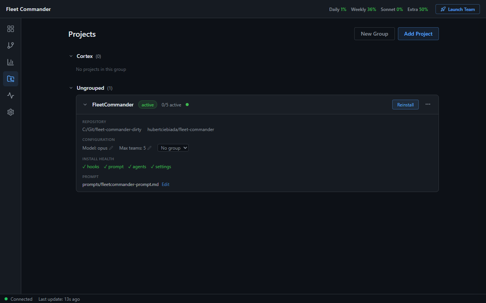
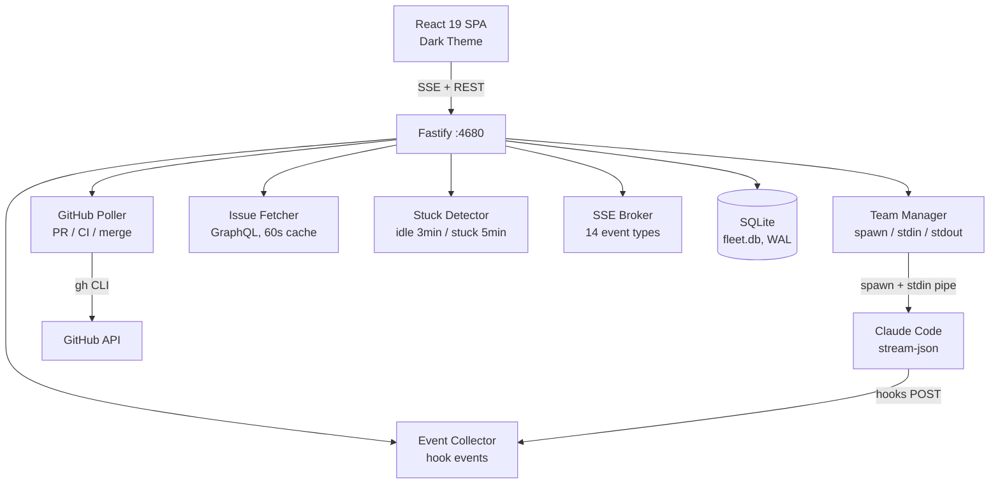
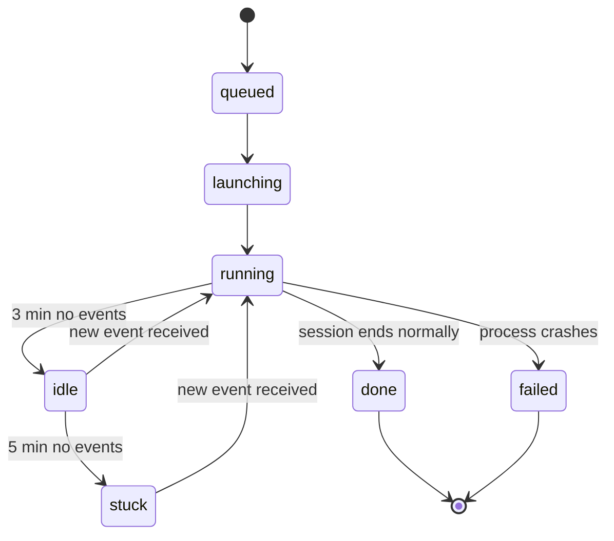

[](https://www.npmjs.com/package/fleet-commander-ai)
[](LICENSE)


[](https://github.com/hubertciebiada/fleet-commander/pulls)

<div align="center">

# Fleet Commander

**One-click dashboard for orchestrating multiple Claude Code agent teams across repositories.**

*Launch, monitor, message, and shut down 15+ parallel AI agents from a single control plane.*



</div>

<!-- TODO: Add hero demo GIF when captured from running instance -->

> **Note:** The npm package name is `fleet-commander-ai` (the npm package name differs from the repo name). CLI binary commands remain `fleet-commander` and `fleet-commander-mcp`.

---

## Why Fleet Commander?

Running 15+ parallel Claude Code agents across multiple repos is chaos without a control plane. You lose track of which teams are working on what, miss CI failures, and have no way to intervene when an agent gets stuck.

| Capability | What it does |
|------------|--------------|
| **Launch** | One-click team launch per GitHub issue. FIFO queue with per-project concurrency limits. |
| **Monitor** | Real-time SSE dashboard with status, phase, PR state, CI checks, and Gantt timeline. |
| **Message** | Send instructions to running agents via stdin pipe. Editable PM message templates. |
| **Track** | GitHub polling every 30s for PRs, CI status, and merges. Auto-merge support. |
| **Detect** | Idle detection at 3 minutes, stuck detection at 5 minutes. Automatic status transitions. |
| **Scale** | Multiple projects (repos), each with independent team slots, queues, and prompt files. |

---

## Quick Start

### Prerequisites

- **Node.js 20+**
- **GitHub CLI** -- authenticated (`gh auth login`)

### Option A: Install from npm (recommended)

```bash
npm install -g fleet-commander-ai
```

Once installed, run `fleet-commander` to start the server on port 4680 and open the dashboard.

Or run without installing:

```bash
npx fleet-commander-ai
```

### Option B: Clone from source

```bash
git clone https://github.com/hubertciebiada/fleet-commander.git
cd fleet-commander
npm run launch
```

This installs dependencies, builds the project, starts the server on port 4680, and opens your browser.

### Windows shortcut

```
Double-click fleet-commander.bat
```

### First steps

1. **Add a project** -- Open the **Projects** view (`/projects`), click **Add Project**, and enter your repo path and GitHub slug (e.g., `org/repo`). Click **Install** to deploy hooks.
2. **Launch a team** -- Open the **Issue Tree** (`/issues`), find an issue, and click the Play button. Fleet Commander creates a worktree, spawns a Claude Code agent, and starts working.

---

## Screenshots

<table>
  <tr>
    <td align="center"><strong>Fleet Grid</strong><br/></td>
    <td align="center"><strong>Team Detail</strong><br/></td>
  </tr>
  <tr>
    <td align="center"><strong>Issue Tree</strong><br/></td>
    <td align="center"><strong>CommGraph</strong><br/></td>
  </tr>
  <tr>
    <td align="center"><strong>Lifecycle</strong><br/></td>
    <td align="center"><strong>Usage</strong><br/></td>
  </tr>
  <tr>
    <td align="center"><strong>Projects</strong><br/></td>
    <td></td>
  </tr>
</table>

<p align="center"><em>Screenshots are auto-generated with <code>npm run capture-screenshots</code>. See <a href="scripts/capture-screenshots.ts">scripts/capture-screenshots.ts</a>.</em></p>

---

## Architecture


<details>
<summary>Mermaid source</summary>



</details>

<details>
<summary>How It Works</summary>

### Hook Events

Claude Code agent sessions fire lifecycle hooks (session start, tool use, notifications, errors, session end). Fleet Commander installs shell scripts into each project repo that POST these events back to the server. All hooks are fire-and-forget -- they exit 0 regardless of whether the POST succeeds, so they never block the agent.

### Stdin/Stdout Pipes

Each agent team is a `child_process.spawn()` of `claude` with `--input-format stream-json --output-format stream-json`. Fleet Commander holds the stdin pipe open to send messages (PM instructions, CI results, merge notifications) and reads stdout for real-time output streaming. The stdout stream is parsed and broadcast to the dashboard via SSE.

### SSE Push

The SSE Broker manages long-lived connections from the React dashboard. It emits 14 event types (team status changes, output chunks, PR updates, usage snapshots, heartbeats, etc.) so the UI updates in real time without polling. A 30-second heartbeat keeps connections alive through proxies.

### GitHub Polling

The GitHub Poller runs every 30 seconds and uses the `gh` CLI (not Octokit) to check for PR state changes, CI check results, and merge status. When it detects a change, it updates the database and broadcasts an SSE event. This is how the dashboard knows when CI passes or a PR is merged.

</details>

---

## Team Lifecycle


<details>
<summary>Mermaid source</summary>



</details>

### Walkthrough

1. **Queued** -- A team is created for an issue and placed in the FIFO queue. It waits here until a slot opens (per-project concurrency limit).
2. **Launching** -- A slot is available. Fleet Commander creates a git worktree, spawns a Claude Code process, and waits for the first event. If no event arrives within the launch timeout (default 5 min), the team is marked failed.
3. **Running** -- The agent is actively working. Hook events stream in, output is captured, and the dashboard shows real-time progress.
4. **Idle** -- No hook events for 3 minutes. The team is flagged but continues running. Any new event transitions it back to running.
5. **Stuck** -- No hook events for 5 minutes (from idle). The team is flagged for PM attention. A message can be sent via stdin to nudge the agent. Any new event transitions it back to running.
6. **Done / Failed** -- The session ends normally (done) or the process crashes / exits non-zero (failed). The worktree and branch can be cleaned up from the Projects view.

**CI flow:** PR detected -> CI green/red -> message to team via stdin -> PR merged -> team marked done

---

## Configuration

All settings have sensible defaults. Override via environment variables:

| Variable | Default | Description |
|----------|---------|-------------|
| `PORT` | `4680` | Server port |
| `FLEET_HOST` | `0.0.0.0` | Network interface to bind to |
| `FLEET_IDLE_THRESHOLD_MIN` | `3` | Minutes before a team is marked idle |
| `FLEET_STUCK_THRESHOLD_MIN` | `5` | Minutes before a team is marked stuck |
| `FLEET_LAUNCH_TIMEOUT_MIN` | `5` | Minutes before a launching team is marked failed |
| `FLEET_MAX_CI_FAILURES` | `3` | Unique CI failure types before blocking |
| `FLEET_EARLY_CRASH_THRESHOLD_SEC` | `120` | Seconds before a SubagentStop is considered an early crash |
| `FLEET_EARLY_CRASH_MIN_TOOLS` | `5` | Minimum tool-use events for a subagent to be considered healthy |
| `FLEET_GITHUB_POLL_MS` | `30000` | GitHub polling interval (ms) |
| `FLEET_DB_PATH` | `./fleet.db` | SQLite database file path |
| `FLEET_TERMINAL` | `auto` | Windows terminal preference: `auto`, `wt`, or `cmd` |
| `FLEET_CLAUDE_CMD` | `claude` | Claude Code CLI command |
| `FLEET_SKIP_PERMISSIONS` | `true` | Skip CC permission prompts (`--dangerously-skip-permissions`) |
| `LOG_LEVEL` | `info` | Server log level |

---

## Built With

| Layer | Technology |
|-------|------------|
| Server | [Fastify 5](https://fastify.dev/) on Node.js 20+ |
| Client | [React 19](https://react.dev/) with [Vite 6](https://vite.dev/) |
| Language | [TypeScript 5.7](https://www.typescriptlang.org/) |
| Database | [SQLite](https://sqlite.org/) via [better-sqlite3](https://github.com/WiseLibs/better-sqlite3), WAL mode |
| Styling | [Tailwind CSS](https://tailwindcss.com/) (GitHub-dark theme) |
| Real-time | Server-Sent Events (SSE) |
| Agent interface | Claude Code CLI (`--input-format stream-json`, `--output-format stream-json`) |
| GitHub | [`gh` CLI](https://cli.github.com/) for all GitHub operations |
| Testing | [Vitest](https://vitest.dev/), [Testing Library](https://testing-library.com/) |

---

## MCP Integration

Fleet Commander exposes tools via the [Model Context Protocol](https://modelcontextprotocol.io/) over stdio transport. This allows Claude Code (or any MCP-compatible client) to query fleet state, launch teams, send messages, and inspect timelines programmatically.

```bash
# Add as an MCP server in Claude Code
claude mcp add fleet-commander -- node bin/fleet-commander-mcp.js
```

Or add a `.mcp.json` to your project root:

```json
{
  "mcpServers": {
    "fleet-commander": {
      "command": "node",
      "args": ["bin/fleet-commander-mcp.js"],
      "cwd": "/path/to/fleet-commander"
    }
  }
}
```

All MCP tools use the `fleet_` prefix (e.g., `fleet_system_health`, `fleet_list_teams`, `fleet_send_message`). See [docs/mcp.md](docs/mcp.md) for the full tool reference and developer guide.

---

## Views

| View | Path | What it shows |
|------|------|---------------|
| **Fleet Grid** | `/` | Team table with status, phase, PR, CI, duration. Toggle to Gantt timeline. |
| **Issue Tree** | `/issues` | GitHub issue hierarchy with search. Play button launches a team per issue. |
| **Usage** | `/usage` | Four progress bars: daily, weekly, Sonnet, and extra usage percentages. |
| **Projects** | `/projects` | CRUD for projects. Install status, cleanup, prompt editor. |
| **Lifecycle** | `/lifecycle` | Team state machine diagram + editable PM message templates. |
| **Settings** | `/settings` | Read-only viewer for current server configuration. |

---

## Development

| Command | Description |
|---------|-------------|
| `npm run dev` | Start dev server + Vite HMR |
| `npm run build` | Production build (tsc + vite) |
| `npm start` | Production server (`node dist/server/index.js`) |
| `npm test` | Run all tests (vitest) |
| `npm run test:client` | Client-only tests |
| `npm run test:e2e` | End-to-end smoke test |
| `npm run launch` | Auto-install, build, open browser |
| `npm run capture-screenshots` | Generate screenshots with Playwright |

---

## Contributing

Contributions are welcome. To get started:

1. **Fork** the repository
2. **Create a branch** from `main` (`git checkout -b feat/your-feature`)
3. **Make your changes** and add tests
4. **Run the test suite** (`npm test`)
5. **Commit** with a clear message (`git commit -m "Add your feature"`)
6. **Push** to your fork (`git push origin feat/your-feature`)
7. **Open a Pull Request** against `main`

Please follow the existing code style and conventions. See [CLAUDE.md](CLAUDE.md) for project-specific guidelines.

---

## License

[Apache-2.0](LICENSE)

---

<div align="center">

[](https://star-history.com/#hubertciebiada/fleet-commander&Date)

</div>
