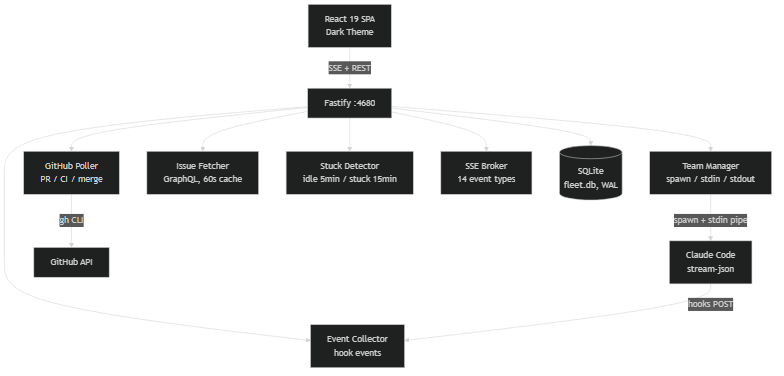
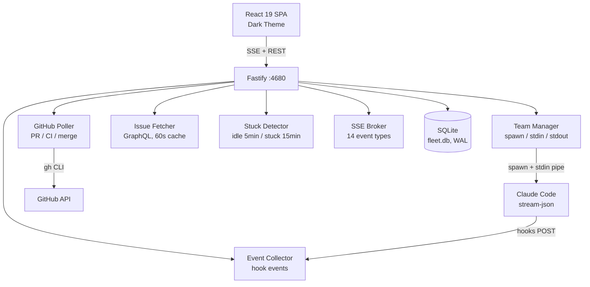
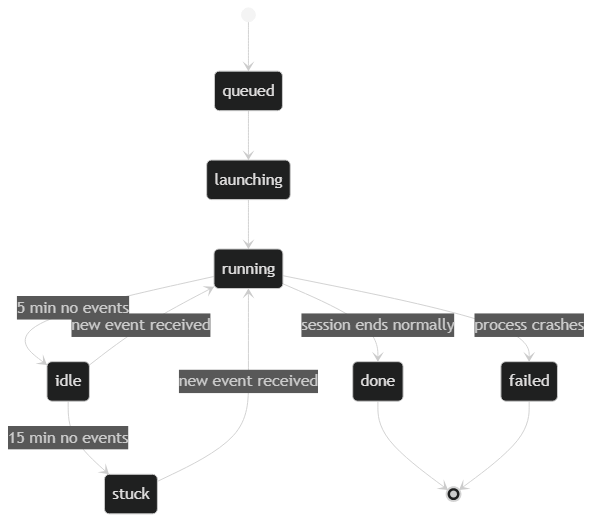
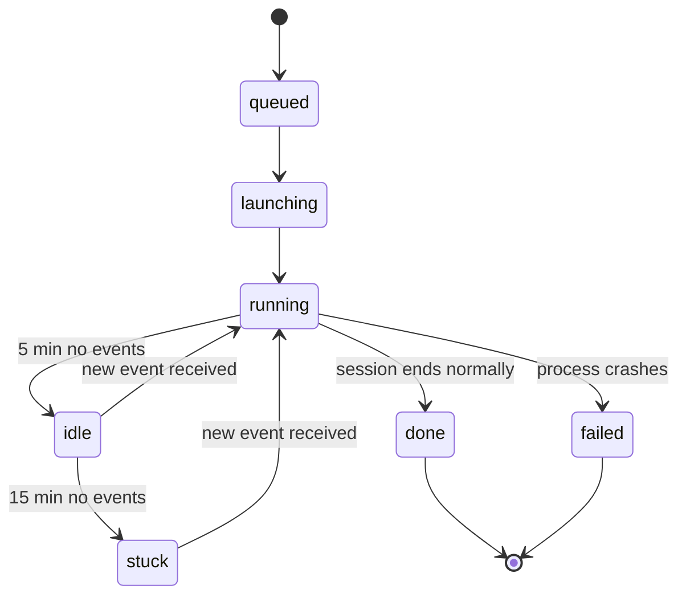

# Fleet Commander

One-click dashboard for orchestrating multiple Claude Code agent teams across repositories.

**No setup. Double-click and go.**

<!-- screenshot -->

## Why

Running 15+ parallel Claude Code agents across multiple repos is chaos without a control plane. You lose track of which teams are working on what, miss CI failures, and have no way to intervene when an agent gets stuck. Fleet Commander gives you a single dashboard to launch, monitor, message, and shut down every agent team from one place.

## Quick Start

**Windows (recommended):**
```
Double-click fleet-commander.bat
```

**Any terminal:**
```bash
npm run launch
```

This installs dependencies, builds the project, starts the server on port 4680, and opens your browser.

## Architecture



<details>
<summary>Mermaid source</summary>



</details>

## Team Lifecycle



<details>
<summary>Mermaid source</summary>



</details>

**CI flow:** PR detected -> CI pending -> CI green/red -> message to team via stdin -> PR merged -> graceful close (stdin.end after 30s)

## Features

- **Multi-project support** -- each project maps to one git repository
- **One-click team launch** -- select an issue, click Play, agent starts working
- **Real-time streaming** -- SSE pushes 14 event types to the dashboard live
- **Bidirectional messaging** -- send commands to running agents via stdin pipe
- **GitHub polling** -- tracks PRs, CI status, and merges every 30 seconds
- **Stuck detection** -- flags idle teams at 5 min, stuck at 15 min
- **Per-project prompt files** -- configurable launch prompts with `{{ISSUE_NUMBER}}` placeholder
- **FIFO queue** -- max active teams per project, excess teams queue automatically
- **PR popover** -- CI check details and auto-merge actions inline
- **Log export** -- download team output as JSON or TXT
- **Install/uninstall scripts** -- deploy hooks, workflow template, and slash command to any repo
- **Windows Terminal integration** -- interactive mode via `wt.exe` for hands-on debugging

## Adding a Project

1. Open the **Projects** view (`/projects`)
2. Click **Add Project**
3. Enter the project name, local repo path, and GitHub repo slug (e.g. `org/repo`)
4. Set **Max Active Teams** (default: 5)
5. Optionally configure a custom prompt file (relative to the repo root)
6. Click **Save**
7. Click **Install** to deploy hooks and the workflow template to the repo

## Views

| View | Path | What it shows |
|------|------|---------------|
| **Fleet Grid** | `/` | Team table with status, phase, PR, CI, duration. Toggle to Gantt timeline. |
| **Issue Tree** | `/issues` | GitHub issue hierarchy with search. Play button launches a team per issue. |
| **Usage** | `/usage` | Four progress bars: daily, weekly, Sonnet, and extra usage percentages. |
| **Projects** | `/projects` | CRUD for projects. Install status, cleanup, prompt editor. |
| **Settings** | `/settings` | Read-only viewer for current server configuration. |

## Configuration

All settings have sensible defaults. Override via environment variables:

| Variable | Default | Description |
|----------|---------|-------------|
| `PORT` | `4680` | Server port |
| `FLEET_IDLE_THRESHOLD_MIN` | `5` | Minutes before a team is marked idle |
| `FLEET_STUCK_THRESHOLD_MIN` | `15` | Minutes before a team is marked stuck |
| `FLEET_MAX_CI_FAILURES` | `3` | Unique CI failure types before blocking |
| `FLEET_GITHUB_POLL_MS` | `30000` | GitHub polling interval (ms) |
| `FLEET_DB_PATH` | `./fleet.db` | SQLite database file path |
| `FLEET_TERMINAL` | `auto` | Windows terminal: `auto`, `wt`, or `cmd` |
| `LOG_LEVEL` | `info` | Log level |

## Development

| Command | Description |
|---------|-------------|
| `npm run dev` | Start dev server + Vite HMR |
| `npm run build` | Production build |
| `npm start` | Production server |
| `npm test` | Run unit and integration tests |
| `npm run test:client` | Client-only tests |
| `npm run test:e2e` | End-to-end smoke test |
| `npm run launch` | Auto-install, build, open browser |

## Prerequisites

- **Node.js 20+**
- **GitHub CLI** -- authenticated (`gh auth login`)

## Known Limitations

- Usage percentage polling is broken ([#37](https://github.com/nickarora/fleet-commander/issues/37))
- Interactive terminal mode (Windows Terminal) is Windows-only
