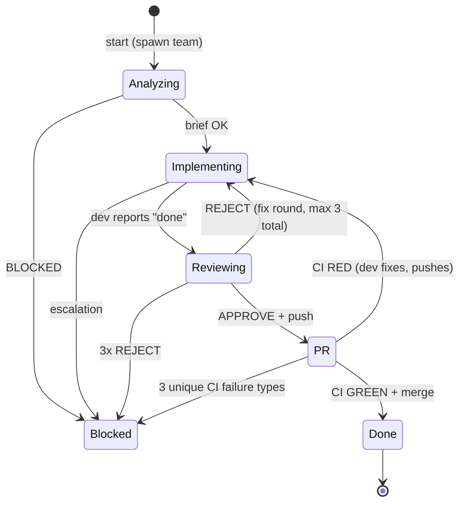

<!-- Fleet Commander workflow template. Installed by Fleet Commander into your project. -->
<!-- Placeholders {{PROJECT_NAME}}, {{project_slug}}, {{BASE_BRANCH}} are replaced during installation. -->

# Workflow {{PROJECT_NAME}}

## About Fleet Commander

Fleet Commander (FC) is the orchestration layer that manages your team. Key facts:

- **Hooks** — FC monitors agent activity via hooks installed in the repo. Every tool use, session start/end, notification, and error is reported automatically. You do not need to report progress manually.
- **CI/PR updates via stdin** — FC watches GitHub for CI results and PR status. When something changes, FC sends a message directly to the Team Lead (TL) via stdin. No PR Watcher agent is needed.
- **Dashboard** — The PM watches all teams from the FC dashboard. They can see your state (Analyzing, Implementing, Reviewing, PR, Done, Blocked), recent events, and output in real time.
- **Messages from FC** — FC may send structured messages to the TL (see "FC Messages" section below). These arrive as stdin messages and should be acted on promptly.

## Entry Point

```
User: claude --worktree {{project_slug}}-{N}
(prompt is sent via stdin from Fleet Commander's prompt file)
```

**Role of TL (main agent = You):**
1. `TeamCreate` -> `issue-{N}`
2. Spawn CORE team immediately (Coordinator + Analyst + Reviewer — see table below)
3. Wait for report from Coordinator ("Done" or "Blocked")
4. When Coordinator requests a specialist spawn (e.g. fleet-dev-typescript) — spawn the appropriate agent into the existing team and confirm to Coordinator that the agent is available
5. `TeamDelete`
6. **Proactivity** — TL MUST actively monitor progress:
   - When an agent is idle >3 min without a report — ask for status
   - When Coordinator does not report after completing a phase — query them
   - TL is the hub that pushes the team forward, NOT a passive observer

All cycle logic lives in the Coordinator (`.claude/agents/fleet-coordinator.md`).

## Team Structure

| Agent | subagent_type | name | Role | Spawn |
|-------|---------------|------|------|-------|
| **Coordinator** | `fleet-coordinator` | `coordinator` | Manages the cycle, creates PR, delegates work | CORE (always) |
| Analyst | `fleet-analyst` | `analyst` | Analyzes issue + codebase, produces brief | CORE (always) |
| Reviewer | `fleet-reviewer` | `reviewer` | Code review + acceptance testing | CORE (always) |
| C# Dev | `fleet-dev-csharp` | `dev-csharp` | C# / .NET implementation | Specialist (on demand) |
| F# Dev | `fleet-dev-fsharp` | `dev-fsharp` | F# implementation | Specialist (on demand) |
| Python Dev | `fleet-dev-python` | `dev-python` | Python implementation | Specialist (on demand) |
| TypeScript Dev | `fleet-dev-typescript` | `dev-typescript` | TypeScript / JS implementation | Specialist (on demand) |
| DevOps Dev | `fleet-dev-devops` | `dev-devops` | CI/CD, infrastructure, Docker, scripts | Specialist (on demand) |
| Generic Dev | `fleet-dev-generic` | `dev-generic` | General-purpose implementation | Specialist (on demand) |

TL spawns the CORE team immediately (without specialists). Specialists are spawned later by TL at Coordinator's request, after the Analyst's brief identifies the required language/area.

## Workflow State Machine



**Blocked can be entered from any active state** when the team cannot proceed (missing info, unresolvable conflicts, repeated failures).

## Communication Protocol

Applies to EVERY agent in the team:

- **SendMessage** with `type: "message"`, `recipient: "{name}"`, `summary: "5-10 words"`
- Messages arrive automatically — no need to poll
- After spawn: `TaskList` — check if you have an assigned task
- After completing a task: `TaskUpdate` -> `status: "completed"`, then `TaskList` for the next one
- On `shutdown_request` -> respond `shutdown_response` with `approve: true`
- **Coordinator is the hub** — agents report TO Coordinator, Coordinator relays

### Work Assignment

- Coordinator uses `TaskCreate` to assign work to specialists
- Coordinator uses `TaskUpdate` to track progress
- For mixed-language work: sequential tasks with `blockedBy` dependencies

### Idle is Normal

- Agents waiting for work or reviews are expected to be idle
- Do NOT ping an agent that has been idle for less than 3 minutes
- TL should query agents idle >3 min without a report

## Brief Format

The Analyst produces a brief in this format (English):

```
ISSUE: #{N} {title}
TYPE: {language} | mixed ({specify languages})
FILES: {list of files to modify/create}
SCOPE: {what needs to change and why}
RISKS: {potential issues, breaking changes, dependencies}
BLOCKED: no | yes → {reason}
```

Coordinator actions based on brief:
- `BLOCKED: yes` → state Blocked
- `BLOCKED: no` → check TYPE, request specialist spawns from TL if needed, then `TaskCreate` for dev(s), state Implementing

## Review Process

Two-pass review by the Reviewer:

1. **Code Quality** — style, correctness, error handling, edge cases, test coverage
2. **Acceptance** — does the change actually solve the issue as described?

Verdict: **APPROVE** or **REJECT** with specific feedback.

- APPROVE → dev pushes branch, state PR
- REJECT → dev fixes (max 2 rounds of rejection, then Blocked)
- **Max 3 review rounds total** (initial + 2 fix rounds)

## PR Rules

### Branch Freshness

**MANDATORY before every push**: the **Coordinator** checks branch freshness and instructs the dev to rebase on the base branch before pushing. The dev does NOT decide when to rebase autonomously — the Coordinator owns this gate.

Coordinator instruction to dev:
```bash
git fetch origin {{BASE_BRANCH}} && git rebase origin/{{BASE_BRANCH}}
```
If rebase fails (conflicts) → state Blocked.

Before creating PR, Coordinator instructs the dev to force-push the rebased branch:
```bash
git fetch origin {{BASE_BRANCH}} && git rebase origin/{{BASE_BRANCH}} && git push --force-with-lease
```

### Auto-Merge (Mandatory)

Every PR MUST have auto-merge set immediately after creation:
```bash
gh pr merge {PR} --auto --squash --delete-branch
```
No exceptions. Auto-merge remains active after fixup pushes — do NOT re-set it.

### Branch Naming

Worktree creates branch `worktree-{{project_slug}}-{N}` from `{{BASE_BRANCH}}`.
Dev renames it to the appropriate convention:

| Prefix | Use |
|--------|-----|
| `feat/{N}-{desc}` | New feature |
| `fix/{N}-{desc}` | Bug fix |
| `test/{N}-{desc}` | Test-only changes |

Coordinator provides the target branch name in the task prompt.

### Commit Format

```
Issue #{N}: {description}
```

Atomic commits — each commit should be a logical unit.

### PR Creation

```bash
gh pr create --base {{BASE_BRANCH}} --title "Issue #{N}: {description}" --body "Closes #{N}"
```

### Build Before Push

**MANDATORY before reporting "done" to Reviewer**: dev must run the project build and any new tests locally. This prevents unnecessary CI iteration.

## FC Messages

Fleet Commander sends these messages directly to the TL via stdin. They arrive automatically — no polling needed.

| Message ID | When | Content |
|------------|------|---------|
| `ci_green` | CI passes on PR | "CI passed on PR #{PR}. All checks green. Auto-merge is {status}." |
| `ci_red` | CI fails on PR | "CI failed on PR #{PR}. Failing checks: {details}. Fix count: {N}/{max}." |
| `ci_blocked` | Too many CI failures | "STOP. {N} unique CI failure types on PR #{PR}. Wait for instructions." |
| `pr_merged` | PR is merged | "PR #{PR} merged. Close the issue, clean up, and finish." |
| `stuck_nudge` | Team idle too long | "You have been idle. What is the status?" |

**On `ci_green`**: Auto-merge will handle the merge. Move to Done once merged.
**On `ci_red`**: Coordinator delegates fix to the dev. This counts toward the failure limit.
**On `ci_blocked`**: STOP all work. Wait for PM instructions from the dashboard.
**On `pr_merged`**: Coordinator closes the issue, reports "Done" to TL, team shuts down.

## State Details

### ANALYZING
- Coordinator waits for brief from Analyst
- BLOCKED=yes → state Blocked
- BLOCKED=no → Coordinator checks TYPE, requests specialist spawns from TL if needed, creates tasks for dev(s), state Implementing

### IMPLEMENTING
- Dev(s) implement, commit atomically: `Issue #{N}: description`
- Mixed-language: sequential tasks (`TaskCreate` with `blockedBy`)
- **MANDATORY**: rebase on `{{BASE_BRANCH}}` before every push
- **MANDATORY**: build + new tests locally before reporting "done"
- Dev reports "done" → Coordinator passes to Reviewer, state Reviewing

### REVIEWING
- Reviewer performs 2-pass review (code quality + acceptance)
- APPROVE → dev pushes branch, state PR
- REJECT → dev fixes (max 2 rejections, then Blocked)

### PR
- Dev pushes rebased branch
- Coordinator creates PR: `gh pr create --base {{BASE_BRANCH}} ...`
- Coordinator sets auto-merge: `gh pr merge {PR} --auto --squash --delete-branch`
- FC monitors CI and sends results via stdin (no PR Watcher needed)
- GREEN → auto-merge handles it, state Done
- RED → dev fixes and pushes. Progress on the same bug type does NOT count as a new failure. Max 3 unique failure types, then Blocked.

### DONE
- Coordinator: update checkboxes in issue → `[x]`, close issue
- Coordinator reports to TL: "Done. PR #{PR} merged."
- TL: `shutdown_request` to everyone → `TeamDelete`

### BLOCKED
- Comment on the issue explaining what is blocking
- STOP all work

## Rules

- **One issue at a time** — atomic changes only
- **CI must be green** — PR CANNOT be merged with red CI
- **Branch from {{BASE_BRANCH}}** — NEVER commit directly to {{BASE_BRANCH}}
- **Coordinator does not implement** — delegate to devs
- **Idle = normal state** — do not ping, wait at least 3 minutes
- **TL does not take over agent tasks** — if an agent is unresponsive, respawn instead of doing their work

## Anti-Patterns

| Wrong | Right |
|-------|-------|
| Coordinator reads code | Delegate to Analyst |
| Coordinator implements | Delegate to Dev |
| Coordinator pings "how's it going?" | Wait for report |
| Dev ignores CI red | ALWAYS fix CI |
| Dev commits to {{BASE_BRANCH}} | Only branch feat/*, fix/*, test/* |
| Dev pushes without rebase | ALWAYS rebase on {{BASE_BRANCH}} before push |
| Dev pushes without local tests | Build + new tests locally BEFORE push |
| Respawn agent after idle | Idle = normal state |
| TL waits passively | TL queries agents after 3 min idle without report |
| TL takes over CI monitoring | FC handles CI monitoring automatically |
| TL spawns a PR Watcher | FC sends CI/PR updates via stdin — no watcher needed |
