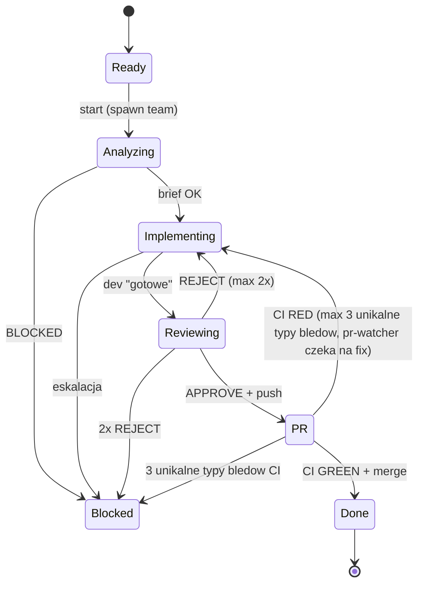

<!-- Fleet Commander workflow template. Installed by Fleet Commander into your project. -->
<!-- Placeholders {{PROJECT_NAME}}, {{project_slug}}, {{BASE_BRANCH}} are replaced during installation. -->

# Workflow {{PROJECT_NAME}}

## Entry point

```
User: claude --worktree {{project_slug}}-{N}
User: /next-issue {N}
```

**Rola TL (glowny agent = Ty):**
1. `TeamCreate` -> `issue-{N}`
2. Spawn CORE teamu od razu (Coordinator + 3 agentow: analityk, dev, weryfikator -- patrz tabela nizej)
3. Czekaj na raport od Coordinatora ("Done" lub "Blocked")
4. Gdy Coordinator poprosi o spawn dodatkowego deva (np. specialized-dev) -- zespawnuj odpowiedniego agenta do istniejacego teamu i potwierdz Coordinatorowi ze agent jest dostepny
5. Gdy Coordinator poprosi o spawn pr-watchera -- zespawnuj `fleet-pr-watcher` z URL PR w prompcie
6. `TeamDelete`
7. **Proaktywnosc** -- TL MUSI aktywnie monitorowac postep:
   - Gdy agent idle >3 min bez raportu -- wyslij mu pytanie o status
   - Gdy pr-watcher nie reaguje na wiadomosci -- respawnuj go (NIGDY nie przejmuj jego zadania)
   - Gdy coordinator nie raportuje po zakonczeniu etapu -- odpytaj go
   - TL jest hubem popychajacym zespol, NIE biernym obserwatorem

Nic wiecej. Cala logika cyklu jest w Coordinatorze (`.claude/agents/fleet-coordinator.md`).

## Diagram stanow



## Team

| Agent | subagent_type | name | Rola | Spawn |
|-------|---------------|------|------|-------|
| **Coordinator** | `fleet-coordinator` | `coordinator` | Zarzadza cyklem, tworzy PR, deleguje monitoring CI | CORE (zawsze) |
| Analityk | `fleet-analityk` | `analityk` | Analiza issue + codebase, brief | CORE (zawsze) |
| Dev | `fleet-dev` | `dev` | Implementacja | CORE (zawsze) |
| Specialized Dev | `fleet-specialized-dev` | `specialized-dev` | Dodatkowa implementacja (inny jezyk/obszar) | warunkowy (na zadanie TL po briefie) |
| Weryfikator | `fleet-weryfikator` | `weryfikator` | Code review + acceptance | CORE (zawsze) |
| PR Watcher | `fleet-pr-watcher` | `pr-watcher` | Monitoring CI | warunkowy (na zadanie TL po PR) |

TL spawnuje CORE team od razu (BEZ specialized-dev, pr-watchera). Agenci warunkowi (specialized-dev) sa spawnowani pozniej przez TL na prosbe Coordinatora, po otrzymaniu briefu od Analityka. PR Watcher jest spawnowany przez TL na prosbe Coordinatora po utworzeniu PR.

## Zasady komunikacji

Obowiazuje KAZDEGO agenta w zespole:

- **SendMessage** z `type: "message"`, `recipient: "{nazwa}"`, `summary: "5-10 slow"`
- Wiadomosci przychodza automatycznie -- nie trzeba sprawdzac
- Po spawnie: `TaskList` -- sprawdz czy masz przypisany task
- Po zakonczeniu taska: `TaskUpdate` -> `status: "completed"`, potem `TaskList` po nastepny
- Na `shutdown_request` -> odpowiedz `shutdown_response` z `approve: true`
- Coordinator jest hubem -- agenci raportuja DO coordinatora, coordinator przekazuje

## Stany -- co robi coordinator

### ANALYZING
- Coordinator czeka na brief od Analityka (format: ISSUE/TYP/PLIKI/ZAKRES/RYZYKA/BLOCKED)
- BLOCKED=tak -> stan Blocked
- BLOCKED=nie:
  - Jesli TYP wymaga dodatkowego deva -> Coordinator prosi TL o spawn odpowiedniego deva(ow) i czeka na potwierdzenie
  - TaskCreate dla Dev(ow) wg TYP, stan Implementing

### IMPLEMENTING
- Dev(owie) implementuja, commituja atomowo: `Issue #{N}: opis`
- Mixed: sekwencyjne taski (TaskCreate z blockedBy)
- **OBOWIAZKOWE przed kazdym push**: Dev musi uruchomic `git fetch origin {{BASE_BRANCH}} && git rebase origin/{{BASE_BRANCH}}` PRZED pushowaniem -- zapobiega konfliktom na PR
- **OBOWIAZKOWE przed "gotowe do review"**: Dev musi uruchomic build + nowe testy lokalnie -- zapobiega iterowaniu po CI
- Dev mowi "gotowe do review" -> coordinator przekazuje Weryfikatorowi, stan Reviewing

### REVIEWING
- Weryfikator robi code review + acceptance check
- APPROVE -> Dev pushuje branch, stan PR
- REJECT -> Dev poprawia (max 2x, potem Blocked)

### PR
- Dev pushuje branch
- Coordinator: PRZED utworzeniem PR, Dev musi zaktualizowac branch:
  ```bash
  git fetch origin {{BASE_BRANCH}} && git rebase origin/{{BASE_BRANCH}} && git push --force-with-lease
  ```
  Jesli rebase failuje (konflikty) -> stan Blocked.
- Coordinator: `gh pr create --base {{BASE_BRANCH}} --title "Issue #{N}: {opis}" --body "Closes #{N}"`
- Coordinator: **BEZWZGLEDNIE** ustawia auto-merge NATYCHMIAST po utworzeniu PR: `gh pr merge {PR} --auto --squash --delete-branch` -- KAZDY PR MUSI miec auto-merge, bez wyjatkow
- Coordinator: prosi TL o spawn `fleet-pr-watcher` z URL PR (SendMessage do TL)
- TL spawnuje `fleet-pr-watcher` z URL PR w prompcie
- PR Watcher uzywa `gh run watch --exit-status` -- blokuje do zakonczenia runu, zero pollowania
- PR Watcher raportuje wynik (GREEN/RED) do Coordinatora przez SendMessage
- GREEN -> auto-merge sam zmerguje PR, stan Done
- RED -> PR Watcher raportuje RED i czeka 5 min na nowy run (dev fixuje, pushuje). PR Watcher automatycznie wykrywa nowy run i watchuje go -- **nie trzeba respawnowac**. Max 3 unikalne typy bledow, potem Blocked. Postep w naprawie tego samego buga (np. 11->3->0 errors) NIE liczy sie jako nowa proba. Po pushu auto-merge pozostaje aktywny -- NIE trzeba ustawiac ponownie.

### DONE
- Coordinator: checkboxy w issue -> `[x]`, status Done, close issue
- Coordinator raportuje do TL: "Done. PR #{PR} zmergowany."
- TL: `shutdown_request` do kazdego -> `TeamDelete`

### BLOCKED
- Komentarz w issue co blokuje
- STOP

## Branch naming

Worktree tworzy branch `worktree-{{project_slug}}-{N}` od `{{BASE_BRANCH}}`.
Dev zmienia nazwe: `git branch -m worktree-{{project_slug}}-{N} feature/{N}-{opis}`
Coordinator podaje docelowa nazwe w prompcie.

## Reguly

- **Jedno issue na raz** -- atomowe zmiany
- **CI musi byc zielone** -- PR NIE MOZE byc zmergowany z czerwonym CI
- **Branch od {{BASE_BRANCH}}** -- NIGDY bezposrednio do {{BASE_BRANCH}}
- **Coordinator nie implementuje** -- deleguje do Devow
- **Idle = normalny stan** -- nie pinguj, czekaj min. 5 min
- **TL nie przejmuje zadan agentow** -- jesli agent nie reaguje, respawnuj go zamiast robic jego prace

## Anti-patterns

| Zle | Dobrze |
|-----|--------|
| Coordinator czyta kod | Deleguj do Analityka |
| Coordinator implementuje | Deleguj do Deva |
| Coordinator pinguje "jak tam?" | Czekaj na raport |
| Dev ignoruje CI red | ZAWSZE napraw CI |
| Dev commituje do {{BASE_BRANCH}} | Tylko branch feature/* |
| Dev pushuje bez rebase | ZAWSZE rebase na {{BASE_BRANCH}} przed push |
| Dev pushuje bez testow lokalnych | Build + nowe testy lokalnie PRZED push |
| Respawn agenta po idle | Idle = normalny stan |
| TL czeka biernie "poczekajmy" | TL odpytuje agentow o status po 3 min idle |
| TL przejmuje monitoring CI | Respawnuj pr-watchera jesli nie reaguje |
| TL uruchamia `gh run watch` | Tylko pr-watcher monitoruje CI |
