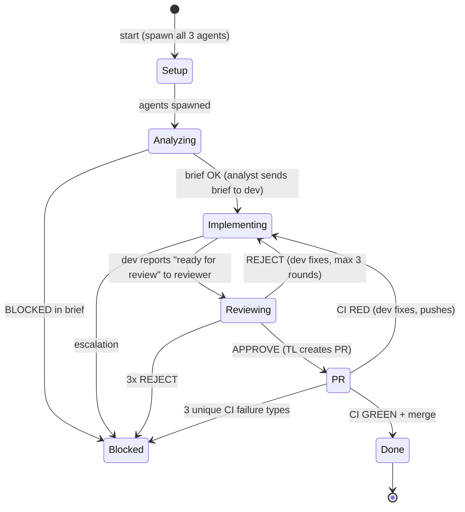

<!-- Fleet Commander workflow template. Installed by Fleet Commander into your project. -->
<!-- Placeholders {{PROJECT_NAME}}, {{project_slug}}, {{BASE_BRANCH}}, {{ISSUE_NUMBER}} are replaced during installation. -->

# Diamond Workflow — {{PROJECT_NAME}}

## About Fleet Commander

Fleet Commander (FC) is the orchestration layer that manages your team. Key facts:

- **Hooks** — FC monitors agent activity via hooks installed in the repo. Every tool use, session start/end, notification, and error is reported automatically. You do not need to report progress manually.
- **CI/PR updates via stdin** — FC watches GitHub for CI results and PR status. When something changes, FC sends a message directly to the Team Lead (TL) via stdin. No PR Watcher agent is needed.
- **Dashboard** — The PM watches all teams from the FC dashboard. They can see your state (Analyzing, Implementing, Reviewing, PR, Done, Blocked), recent events, and output in real time.
- **Messages from FC** — FC may send structured messages to the TL (see "FC Messages" section below). These arrive as stdin messages and should be acted on promptly.
- **Idle/Stuck thresholds** — FC marks agents idle after 3 minutes of inactivity and stuck after 5 minutes. Agents waiting for peer messages are expected to be idle — this is normal. TL should only intervene when stuck.

## Entry Point

```
User: claude --worktree {{project_slug}}-{N}
(prompt is sent via stdin from Fleet Commander's prompt file)
```

**Role of TL (main agent = You):**
1. Read this workflow and understand the team structure
2. **Spawn ALL 3 agents immediately** — `fleet-analyst`, `fleet-dev`, and `fleet-reviewer` — in parallel at startup
3. Analyst analyzes the issue and sends brief directly to dev (and CCs reviewer) via `SendMessage`
4. Dev enters warm-up phase (reads CLAUDE.md, guidebooks, explores codebase) while waiting for the brief
5. Reviewer enters pre-read phase (reads CLAUDE.md, guidebooks, familiarizes with codebase) while waiting for review request
6. Once dev receives the brief, it transitions to implementation
7. Once dev reports "ready for review" to reviewer, reviewer transitions to active review
8. Let dev and reviewer communicate peer-to-peer — DO NOT relay messages between them
9. Only intervene if: escalation after 3 review rounds, agent stuck (5min idle), or final PR creation
10. When review passes: rebase, create PR, set auto-merge
11. Respond to FC messages (ci_green, ci_red, pr_merged, nudge_idle, nudge_stuck)
12. On pr_merged: close issue, shut down agents, finish

## Team Composition — Diamond (3 Agents)

| Agent | subagent_type | name | Role | Spawn |
|-------|---------------|------|------|-------|
| **Analyst** | `fleet-analyst` | `analyst` | Analyzes issue + codebase, produces structured brief with guidebook paths. Sends brief directly to dev and CCs reviewer. | Phase 0 (immediate) |
| **Dev** | `fleet-dev` | `dev` | Warm-up phase (read-only) until brief arrives, then implements code, writes tests, pushes commits. Communicates with reviewer directly during review. | Phase 0 (immediate) |
| **Reviewer** | `fleet-reviewer` | `reviewer` | Pre-read phase (read-only) until review request arrives, then two-pass code review. Sends feedback directly to dev. Reports final verdict to TL. | Phase 0 (immediate) |

There is NO coordinator agent. The TL orchestrates all three agents directly.

All agents use `model: inherit` — they run on the same model as the TL.

### Agent Lifecycle

- **All 3 agents are spawned immediately at startup** (Phase 0). No agent waits for another to finish before being spawned.
- **Analyst** analyzes the issue, produces the brief, sends it directly to dev (and CCs reviewer) via `SendMessage`, then exits. It does not persist.
- **Dev** enters a **warm-up phase** on spawn: reads CLAUDE.md, reads guidebooks from the task prompt, explores the codebase. When the analyst's brief arrives via `SendMessage`, dev transitions to implementation. Dev persists through implementation, review rounds, and CI fixes.
- **Reviewer** enters a **pre-read phase** on spawn: reads CLAUDE.md, reads guidebooks, familiarizes with the codebase and issue context. When dev sends a review request via `SendMessage`, reviewer transitions to active review. Reviewer persists through all review rounds.
- Dev and Reviewer communicate **peer-to-peer** — TL does not relay messages between them.
- **Token efficiency**: Dev and reviewer use their wait time productively (warm-up / pre-read), so spawning them early does not waste tokens — it frontloads context-gathering that would happen anyway.

### TYPE to Guidebook Mapping

All implementation work is assigned to the single `fleet-dev` agent. The Analyst's TYPE and Guidebooks fields tell the dev which guidebooks to read for domain-specific conventions.

| TYPE in brief | Guidebooks to read |
|---------------|-------------------|
| C# / .NET | `csharp-conventions.md` |
| F# | `fsharp-conventions.md` |
| TypeScript / JS | `typescript-conventions.md` |
| Python | `python-conventions.md` |
| Infrastructure / CI | `devops-conventions.md` |
| Generic / unknown | CLAUDE.md only (no language-specific guidebook) |
| Mixed (A + B) | Multiple guidebooks — dev reads all relevant ones |

## Workflow State Machine



**All 3 agents are spawned during Setup.** Phase transitions are logical — they represent which agent is actively doing primary work, not when agents are spawned.

**Blocked can be entered from any active state** when the team cannot proceed (missing info, unresolvable conflicts, repeated failures).

---

## Phase 0 — Setup (Parallel Spawn)

1. **TL spawns ALL 3 agents immediately in parallel:**
   - `fleet-analyst` — with the issue number and project context
   - `fleet-dev` — with the issue number, target branch name, and guidebook list from the task prompt. Dev enters **warm-up phase** (reads CLAUDE.md, guidebooks, explores codebase).
   - `fleet-reviewer` — with the issue number and base branch. Reviewer enters **pre-read phase** (reads CLAUDE.md, guidebooks, familiarizes with codebase).
2. Dev and reviewer are productive during their wait — they frontload context-gathering that would otherwise happen after the brief arrives.

---

## Phase 1 — Analysis

1. Analyst (already spawned in Phase 0) reads the issue, explores the codebase, discovers guidebooks, and produces a structured brief
2. **Analyst sends the brief directly to dev via `SendMessage`** AND **CCs reviewer** (sends the brief to reviewer too via a second `SendMessage`)
3. Brief also arrives to TL (analyst sends to TL as well for validation)
4. TL validates the brief has all required fields (see format below)
5. TL evaluates the brief:
   - `BLOCKED=yes` → state Blocked, comment on issue, shut down dev and reviewer, STOP
   - `BLOCKED=no` → proceed to Phase 2 (dev already has the brief and transitions from warm-up to implementation)
   - Missing required fields → ask Analyst to redo with specific gaps identified

### Brief Format

The Analyst produces a brief in this format:

```
## Analysis Brief for Issue #{N}

### Language/Framework
{primary language} / {framework(s)}

### Guidebooks
- {path/to/guidebook1.md}
- {path/to/guidebook2.md}
- (none found)

### Type
{single | mixed} — {developer mapping}

### Key Files
- {path} — {what changes and why}

### What Needs to Change
{Detailed analysis with implementation approach}

### Risks
- {specific risk or edge case}

### Blocked
no | yes — {reason}
```

### Edge Case: Analyst Fails

If the Analyst is unresponsive for >5 minutes or produces an unusable brief:
1. TL performs a quick analysis directly: read `CLAUDE.md`, scan the issue, identify key files
2. Produce a minimal brief (Key Files + What Needs to Change + Type is enough)
3. **Send the brief to dev and reviewer via `SendMessage`** — they are already spawned and waiting in warm-up/pre-read
4. Proceed to Phase 2
5. Do NOT spend more than a few minutes on this — a good-enough brief is better than a perfect one

---

## Phase 2 — Implementation

1. Dev (already spawned in Phase 0, in warm-up phase) receives the analyst's brief via `SendMessage`
2. Dev transitions from warm-up to implementation — guidebooks and CLAUDE.md are already read from warm-up
3. Dev implements, tests locally, commits atomically
4. **Dev sends review request directly to reviewer via `SendMessage`** (reviewer is already spawned and in pre-read phase)
5. Dev also notifies TL: "Ready for review. Branch: `{branch}`"
6. TL transitions to Phase 3

### Dev Task Format (sent via TaskCreate at spawn)

```
ISSUE: #{N} {title}
BRANCH: {feat|fix|test}/{N}-{short-desc}
BASE: {{BASE_BRANCH}}

GUIDEBOOKS (read these during warm-up):
{list of known guidebook paths from project conventions, e.g., CLAUDE.md}

WARM-UP INSTRUCTIONS (start immediately, before brief arrives):
1. Read CLAUDE.md in the project root
2. Read each guidebook file listed above
3. Explore the codebase — understand relevant files, patterns, test structure
4. Wait for the analyst's brief to arrive via SendMessage from "analyst"

IMPLEMENTATION INSTRUCTIONS (after brief arrives via SendMessage):
1. Parse the analyst's brief for any additional guidebook paths — read those too
2. Implement the changes described in the brief
3. Follow conventions from CLAUDE.md and guidebooks
4. Run build + tests locally before reporting ready
5. Commit atomically: "Issue #{N}: {description}"
6. Send review request directly to "reviewer" via SendMessage
7. Also report "Ready for review. Branch: {branch}" to TL
```

### Mixed-Language Work

For mixed-type issues (e.g., C# backend + TypeScript frontend):
1. Spawn the primary dev first (larger scope)
2. When primary dev completes, spawn secondary dev with `blockedBy` dependency
3. Wait for both to complete before review

### Edge Case: Dev Gets Stuck

- FC's stuck detector will nudge TL if the team is idle too long
- TL checks if the dev agent is still active (TaskList)
- If dev is stuck: send a message with more context, hints, or simplified scope
- If dev is unresponsive after nudge: stop the dev agent, spawn a fresh one with additional context from the failed attempt

---

## Phase 3 — Review (Peer-to-Peer)

1. Reviewer (already spawned in Phase 0, in pre-read phase) receives the review request from dev via `SendMessage`
2. Reviewer transitions from pre-read to active review — CLAUDE.md and guidebooks are already read from pre-read
3. **Dev and reviewer already know each other's names** (set at spawn time). No TL introduction needed.
4. **TL steps back.** The dev-reviewer loop runs peer-to-peer:
   - Reviewer performs two-pass review (code quality + acceptance)
   - **REJECT** → reviewer sends actionable feedback directly to dev → dev fixes and re-requests review from reviewer directly
   - **APPROVE** → reviewer notifies TL with the final verdict
5. TL monitors but does NOT intervene unless:
   - **3 review rounds exhausted** → TL arbitrates (see Error Handling)
   - **Agent stuck** (5min idle) → TL sends a nudge
   - **Escalation request** from either agent → TL steps in

### Reviewer Task Format (sent via TaskCreate at spawn)

```
ISSUE: #{N} {title}
BRANCH: (will be provided by dev when ready for review)
BASE: {{BASE_BRANCH}}

PRE-READ INSTRUCTIONS (start immediately, before review request arrives):
1. Read CLAUDE.md in the project root
2. Read any guidebook files listed below
3. Familiarize yourself with the codebase: structure, patterns, conventions
4. Read the GitHub issue for acceptance criteria
5. Wait for the dev's review request to arrive via SendMessage from "dev"

REVIEW INSTRUCTIONS (after review request arrives via SendMessage):
Review the changes on the branch against the base branch.
Two-pass review: code quality + acceptance criteria from the issue.

PEERS:
- Dev agent name: dev
- Send rejection feedback DIRECTLY to dev via SendMessage
- Send final APPROVE or REJECT verdict to TL (me)

If you reject, include a numbered list of specific, actionable fixes with file:line references.
Dev will fix and message you directly when ready for re-review.
Max 3 review rounds total (initial + 2 re-reviews).
After 3rd rejection, report BLOCKED to TL.
```

### TL Non-Intervention Rules

During the dev↔reviewer loop, TL MUST NOT:
- Relay messages between dev and reviewer (they talk directly)
- Ask "how's it going?" before an agent is stuck (5min)
- Override reviewer's verdict (until round 3 escalation)
- Tell dev to skip fixing a review comment
- Inject new requirements not in the original issue

TL MAY:
- Respond to FC messages (ci_red, nudge_stuck, etc.)
- Intervene on escalation from either agent
- Arbitrate after 3 failed review rounds
- Nudge an agent that has been idle for 5+ minutes

---

## Phase 4 — PR

After reviewer sends APPROVE to TL:

1. **Branch freshness check** (MANDATORY):
   ```bash
   git fetch origin {{BASE_BRANCH}} && git rebase origin/{{BASE_BRANCH}} && git push --force-with-lease
   ```
   If rebase fails (conflicts) → state Blocked.

2. **TL creates PR**:
   ```bash
   gh pr create --base {{BASE_BRANCH}} --title "Issue #{N}: {description}" --body "Closes #{N}"
   ```

3. **Set auto-merge immediately** (mandatory, no exceptions):
   ```bash
   gh pr merge {PR} --auto --squash --delete-branch
   ```

4. Wait for FC to send CI status via stdin:
   - `ci_green` → auto-merge handles merge → wait for `pr_merged`
   - `ci_red` → TL forwards failure details to dev → dev fixes and pushes
   - After 3 unique CI failure types → state Blocked (FC sends `ci_blocked`)
   - `pr_merged` → state Done

---

## Phase 5 — Done

1. Close issue: `gh issue close {N} --comment "Closed. PR #{PR} merged."`
2. `shutdown_request` to all active subagents → wait for `shutdown_response`
3. TL finishes

---

## BLOCKED State

Entered from any phase when the team cannot proceed:
1. Comment on the issue explaining what blocks progress
2. Report blocker details to FC (visible in dashboard)
3. STOP all work — wait for PM instructions from FC dashboard

---

## FC Messages

Fleet Commander sends these messages directly to the TL via stdin. They arrive automatically — no polling needed.

| Message ID | When | Content |
|------------|------|---------|
| `ci_green` | CI passes on PR | "CI passed on PR #{PR}. All checks green. Auto-merge is {status}." |
| `ci_red` | CI fails on PR | "CI failed on PR #{PR}. Failing checks: {details}. Fix count: {N}/{max}." |
| `ci_blocked` | Too many CI failures | "STOP. {N} unique CI failure types on PR #{PR}. Wait for instructions." |
| `pr_merged` | PR is merged | "PR #{PR} merged. Close the issue, clean up, and finish." |
| `nudge_idle` | Team idle 3+ min | "You have been idle for a while. What is the status?" |
| `nudge_stuck` | Team stuck 5+ min | "You appear stuck. Report status or ask for help." |

### TL Response to FC Messages

**On `ci_green`**: Auto-merge will handle the merge. Acknowledge and wait for `pr_merged`.

**On `ci_red`**: Forward failure details to dev. Dev fixes and pushes. This counts toward the failure limit.

**On `ci_blocked`**: STOP all work. Wait for PM instructions from the dashboard.

**On `pr_merged`**: Close the issue, shut down agents (`shutdown_request` to all), finish.

**On `nudge_idle`**: Report current status to FC. If waiting for a subagent, check on them.

**On `nudge_stuck`**: Check which agent is stuck. Send a targeted nudge. If no progress after nudge, escalate to FC by reporting status.

---

## Error Handling

### Agent Spawn Failure

If spawning any agent fails:
1. **Retry once** — wait 5 seconds, attempt spawn again
2. **If retry fails** — TL takes over that agent's role:
   - Analyst fails → TL does the analysis themselves
   - Dev fails → TL implements the code themselves
   - Reviewer fails → TL reviews the code themselves (still two-pass)
3. Log the failure for FC visibility (FC sees it via hooks)

### Test Failure During Implementation

1. Dev runs tests locally before reporting "ready for review"
2. If tests fail → dev fixes and re-runs until green
3. Dev does NOT report "ready for review" with failing tests
4. If dev cannot fix tests after reasonable effort → dev reports blocker to TL → TL may assist or escalate

### Review Loop Stuck (3 Rounds Exhausted)

After 3 review rounds (initial + 2 fix rounds) with REJECT:
1. Reviewer sends `BLOCKED — 3 review rounds exhausted` to TL
2. TL reads the latest rejection feedback and the current code
3. TL arbitrates:
   - If remaining issues are minor nits → TL overrides and proceeds to PR
   - If remaining issues are substantive → TL sends specific guidance to dev for one final attempt
   - If fundamentally broken → state Blocked, comment on issue

### Dev and Reviewer Disagree

If the same issue bounces back and forth between dev and reviewer:
- After round 2, if the same point is still contested, reviewer escalates to TL
- TL reads the diff and the reviewer's feedback
- TL arbitrates: either side with the reviewer (dev must fix) or override the reviewer (approve with noted exception)

### CI Failure Handling

1. `ci_red` received → TL forwards failure details to dev
2. Dev fixes the failing tests/checks and pushes
3. Progress on the same failure type does NOT count as a new unique failure
4. After 3 unique failure types → state Blocked (FC sends `ci_blocked`)

### Rebase Conflict

1. If `git rebase origin/{{BASE_BRANCH}}` fails with conflicts → state Blocked
2. Comment on issue explaining the conflict
3. STOP — do not attempt manual conflict resolution across worktrees

---

## Branch Naming

The TL determines the branch name based on the issue type and provides it to the dev in the task prompt:

| Prefix | Use |
|--------|-----|
| `feat/{N}-{desc}` | New feature |
| `fix/{N}-{desc}` | Bug fix |
| `test/{N}-{desc}` | Test-only changes |

### Commit Format

```
Issue #{N}: {description}
```

Atomic commits — each commit should be a logical unit.

### Build Before Review

**MANDATORY before reporting "ready for review"**: dev must run the project build and any new tests locally. This prevents unnecessary review iteration.

---

## Rules

- **One issue at a time** — atomic changes only
- **CI must be green** — PR CANNOT be merged with red CI
- **Branch from {{BASE_BRANCH}}** — NEVER commit directly to {{BASE_BRANCH}}
- **TL creates the PR** — dev pushes code, TL creates the PR and sets auto-merge
- **P2P for review** — dev and reviewer talk directly, TL does not relay
- **Idle = normal** — agents waiting for messages are expected to be idle
- **TL intervenes only on escalation, stuck, or PR** — do not micromanage the dev↔reviewer loop
- **Respond to FC messages promptly** — FC messages arrive via stdin and require action
- **TL does not implement** — spawn subagents for all work (except analyst fallback)
- **Analyst failure is not fatal** — TL can produce a minimal brief if analyst fails

## Anti-Patterns

| Wrong | Right |
|-------|-------|
| TL relays messages between dev and reviewer | Dev and reviewer talk directly (p2p) |
| TL asks "how's it going?" every minute | Wait for report or 5min stuck threshold |
| TL implements code while dev is active | Let dev do the implementation |
| TL overrides reviewer without reading feedback | Read feedback, arbitrate only after 3 rounds |
| Dev pushes without local tests | Build + tests locally BEFORE reporting ready |
| Dev pushes without rebase | ALWAYS rebase on {{BASE_BRANCH}} before push |
| Dev creates the PR | TL creates the PR after APPROVE |
| Spawning a coordinator / 4th agent | Diamond team is exactly 3 agents: analyst, dev, reviewer |
| Spawning agents sequentially (waiting for each phase) | Spawn all 3 agents immediately at startup — they warm up in parallel |
| Dev starts implementing before brief arrives | Dev must stay in warm-up (read-only) until analyst's brief arrives via SendMessage |
| Reviewer starts reviewing before dev sends review request | Reviewer must stay in pre-read (read-only) until dev's review request arrives via SendMessage |
| Ignoring FC messages | Always respond to ci_green, ci_red, pr_merged, nudges |
| Respawning agent after 2 min idle | Idle is normal — only act at 5min stuck threshold |
| TL monitors CI manually | FC handles CI monitoring and sends updates via stdin |

## Decision Summary

```
Phase 0: TL → spawn ALL 3 agents in parallel (analyst, dev, reviewer)
         Dev enters warm-up (read-only). Reviewer enters pre-read (read-only).
Phase 1: Analyst analyzes → sends brief to dev + reviewer + TL → analyst exits
Phase 2: Dev receives brief → transitions to implementation → sends review request to reviewer
Phase 3: Reviewer receives review request → transitions to active review → dev + reviewer iterate p2p → reviewer reports verdict to TL
Phase 4: TL → rebase → create PR → set auto-merge → FC monitors CI
Phase 5: TL → close issue → shutdown agents → finish
```

Edge cases:
- Analyst fails → TL does quick analysis, sends brief to dev and reviewer manually
- Analyst declares BLOCKED → TL shuts down dev and reviewer (they were warming up)
- Dev stuck → TL nudges, then restarts with more context
- 3 rejections → TL arbitrates: simplify, override nits, restart dev, or abort
- Dev/Reviewer disagree → TL arbitrates after round 2
- CI blocked → STOP, wait for PM
